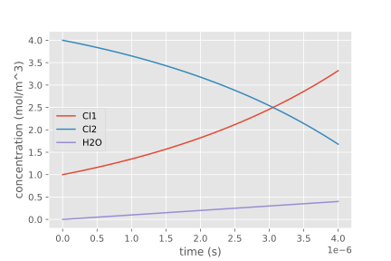
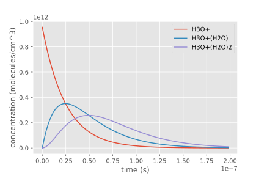
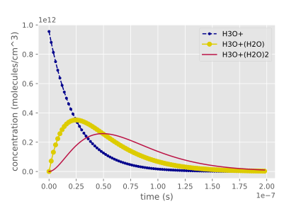
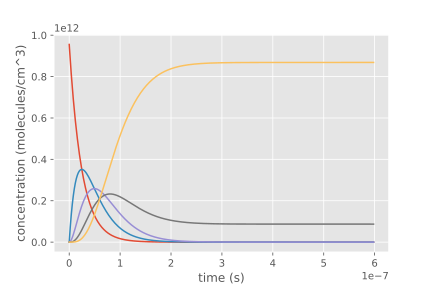
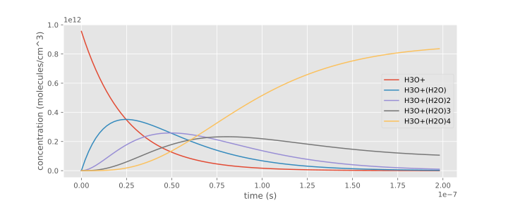

.. _usersguide-visualization:

==========================
Visualization and Plotting
==========================

The :py:mod:`kineticsPy.analysis.visualization` module contains visualization and plotting methods for kinetic simulation results. Currently, plotting of simulated concentration-time profiles is the primary method provided by the module. 

Concentration-Time Profile Plotting
=====================================

Concentration-time profiles can be plotted as line plots with :py:func:`kineticsPy.analysis.visualization.plot`. This plot function provides a convenient interface for most common plotting requirements. 

.. note::
    The following guide assumes that :py:func:`kineticsPy.analysis.visualization.plot` is used in a `jupyter <https://jupyter.org/>`_ notebook / lab environment. In other environments the plots will not be necessarily shown automatically. The plot function generates and returns `matplotlib <https://matplotlib.org/>`_ figures, which usually can be shown with their ``.show()`` method. See the matplotlib documentation and the documentation of your environment the code is run in (iPython, PyCharm, Spyder etc.). 

--------------------------------
Simple full plot of a trajectory 
--------------------------------

The plot function becomes available by importing ``kineticsPy``. Most simply, it takes a kinetic trajectory and returns a matplotlib plot of the trajectory:

.. code-block:: python

    import kineticsPy as kpy  # plot function is exported by kineticsPy directly

    # plot full trajectory (sim_result is a Trajectory containing a simulation result)
    kpy.plot(sim_result);

yields for example

-----------------------------
Selection of chemical species
-----------------------------

Chemical species can be selected by passing a list of identifier strings to the plot function as second parameter. For example, the selection of two species (``Cl2`` and ``H2O``): 

.. code-block:: python

    kpy.plot(sim_result, ['Cl2', 'H2O']);

produces a plot with only two concentration profiles: 

.. image:: images/concentration_plot_species_selection_01.svg
    :alt: Simple line plot of an example trajectory with two species selected

a tuple instead of a list is also valid:

.. code-block:: python

    kpy.plot(sim_result, ('Cl2', 'H2O'));

It is also possible to use a single identifier instead of a list:

.. code-block:: python

    kpy.plot(sim_result, 'Cl2');

----------------------------
Selection of time step range
----------------------------

The time segment which is plotted can be selected with the ``time_steps`` parameter of the plot function, which is also the 3rd unnamed parameter of the function. The time range is specified in terms of time step numbers / time step indices. 

Without specfication of a time range, the whole trajectory is plotted: 

.. code-block:: python 

    # (cl_sim_result is an example simulation result of a water cluster equilibrium simulation)
    kpy.plot(cl_sim_result)

Plotting up to a time step
--------------------------

If a single time step index is passed, all time steps *up to* the specified time step are plotted: 

.. code-block:: python 

    kpy.plot(cl_sim_result, time_steps=100)

since the ``time_step`` parameter can also be used as third unnamed parameter, a species and time range selection can be combined conveniently: 

.. code-block:: python 

    kpy.plot(cl_sim_result, ['H3O+', 'H3O+(H2O)','H3O+(H2O)2'], 100)

Time step range with lower and upper bound
------------------------------------------

A lower and an upper bound of the the plotted time range is selected by passing a ``tuple`` with two elements to ``time_steps``

.. code-block:: python 

    kpy.plot(cl_sim_result, time_steps=(40, 200))

-------------------------------------------
Custom plot line / symbol styles and colors
-------------------------------------------

The drawing style and the color of the individual plot lines can be customized by passing a list of species names and their plot style configuration as second parameter to the plot function. This configuration list has one entry per line to draw. Each entry consists of a chemical species name, a matplotlib format string for the chemical species (see `matplotlib documentation <https://matplotlib.org/stable/api/_as_gen/matplotlib.pyplot.plot.html#matplotlib.pyplot.plot>`_ for details), and a color (also as defined by matplotlib).

.. code-block:: python 

    plot_conf = [
        ('H3O+', '.--', 'darkblue'),    # color names are allowed
        ('H3O+(H2O)', 'o-', '#DDCC00'), # color hex codes are also allowed
        ('H3O+(H2O)2', '-', '#BB1144')
    ]

    kpy.plot(cl_sim_result, plot_conf)

------
Legend
------

By default a legend of the species names and their line styles is presented in the plot. The rendering of the legend can be controlled with the ``legend`` named parameter of the plot function. 

The legend can be switched off by passing ``off``  as legend parameter:

.. code-block:: python 

    kpy.plot(cl_sim_result, legend='off')

By default, the legend location is optimized not to intersect with plot lines (``best`` legend location as defined by matplotlib). The legend location can be controlled by passing a legend position identifier, as defined by matplotlib (see `matplotlib legend documentation <https://matplotlib.org/stable/api/_as_gen/matplotlib.axes.Axes.legend.html#matplotlib.axes.Axes.legend>`_ for details) as legend parameter:

.. code-block:: python 

    kpy.plot(cl_sim_result, legend='upper left')

---------
Plot size
---------

The size of the plot figure is set with the ``figsize`` named parameter, which takes a list or tuple of a width and a height: 

.. code-block:: python 

    kpy.plot(cl_sim_result, figsize=(10,4))

Equilibrium concentration plots
===============================

Simple plots of an equilibrium state of a trajectory can be created with :py:func:`kineticsPy.analysis.visualization.plot_equilibrium_state`. This function takes a kinetic trajectory and creates a simple bar plot of the equilibrium concentrations, by averaging the concentrations in the last time steps of a kinetic trajectory:

.. code-block:: python 

    kpy.plot_equilibrium_state(cl_sim_result, log=True)

The ``log`` option switches to logarithmic scaling of the concentration axis. The ``time_steps`` sets how many time steps at the end of the trajectory are considered for the averaging. If the relative fluctuation of a chemical species in the considered time segment is larger than ``reltol``, the trajectory is considered not to be converged and an exception will be risen: 

.. code-block:: python 

    kpy.plot_equilibrium_state(cl_sim_result, time_steps=200, reltol=0.005)
